The contract is the artifact. Everything else is input to it, a check on it, or a record of why it changed.

A task enters at `P1 · SHAPE` and leaves through `P5 · RECORD`, passing five gates, then re-enters as a sweep. `P7 · CONTEXT ECONOMY` applies at every phase, not at one point in the sequence.

## Gates

| Gate | Holds when |
|---|---|
| `one task in flight` | No second plan is live. Finish or abandon before starting. |
| `contract is the only durable description` | Types, names and signatures carry the meaning. A rule the type cannot express becomes a precondition in the signature. Nothing restates the code in prose. |
| `verifier has not read the implementation` | The checking agent works from the contract in a separate context with no shared history. A verifier that has seen the code inherits its assumptions. |
| `change closes net-negative, or states why not` | Superseded paths are unreachable and gone. Growth needs a reason on the record. |
| `contract satisfied and recorded` | Properties hold, and the commit message carries the reason the contract changed. |

## Traversal

Walk each phase head to tail. Dotted edges are backreferences and the label is the condition that fires them — take them and re-walk from where you land. `P8 · STANDING TENSIONS` is dashed: those anchors are costs this method accepts, not problems it solves. When one fires, take a local exception and record the reason rather than reversing the method.

## Iteration

`contract satisfied and recorded` is not the end. It opens a sweep: every phase re-entered against the whole artifact rather than the one task. A sweep fires a backreference for each of — a gate reopened, a property falsified, a budget above its known floor, the artifact grew, context spend per unit of change rose, a tension fired. Each routes to the phase that owns it. Take them all, then sweep again.

Two terminals, and only two.

**Fixed point.** A sweep changes nothing: no gate reopens, no counterexample survives, no measure moves. Stop. This is the operational meaning of done — a least fixed point of the sweep, not a proof of correctness. Lower bounds are part of it: where a cost already sits at its information-theoretic or algorithmic floor, further work is not improvement.

**Surface.** The variant — the count of open conditions — failed to decrease, or one condition fired twice with no new information. Stop and hand the ambiguity to a person. Do not sweep again. A loop that cannot show a decreasing measure does not terminate, and iterating it converts a decision problem into wasted budget.

Two results bound the loop and appear in `P9` as nodes rather than caveats. Rice: no analyser decides an arbitrary semantic property, so a sweep confirms the absence of *found* defects, never their absence. Lehman: an in-use system faces a changing environment, so a fixed point is provisional — it holds until the environment moves, then `P1` reopens.

Monotonicity is enforced, not assumed. A sweep may not trade a fixed condition for a new one; every measure that improved must stay improved.

## Graph

```mermaid
flowchart TB

%% solid = forward step   dotted = backreference, label is the condition that triggers it
%% diamond = gate: a condition that must hold before the phase advances

  G_START{"one task in flight"}
  G_CONTRACT{"contract is the only durable description"}
  G_INDEP{"verifier has not read the implementation"}
  G_NET{"change closes net-negative, or states why not"}
  G_DONE{"contract satisfied and recorded"}
  G_SWEEP{"full sweep, all phases"}
  G_FIXPOINT{"sweep changed nothing"}
  G_SURFACE{"variant did not decrease"}

  subgraph P1["P1 · SHAPE"]
    direction TB
    JTBD["Jobs To Be Done — Clayton Christensen"]
    XYPROB["XY Problem"]
    EARS["EARS Requirements Syntax — Alistair Mavin"]
    INVEST["INVEST — Bill Wake"]
    THINSLICE["Thin Vertical Slice — Alistair Cockburn"]
    SPIKE["Spike Solution — Kent Beck"]
    YAGNI["YAGNI — Ron Jeffries"]
    LIVEPLAN["Live Plan, Current Task Only"]
    JTBD --> XYPROB --> EARS --> INVEST --> THINSLICE
    THINSLICE --> SPIKE --> YAGNI --> LIVEPLAN
  end

  subgraph P2["P2 · CONTRACT"]
    direction TB
    UBIQ["Ubiquitous Language — Eric Evans"]
    CLEANNAME["Intention-Revealing Names — Robert C. Martin"]
    MILNER["Well-Typed Programs Cannot Go Wrong — Robin Milner"]
    ILLEGAL["Make Illegal States Unrepresentable — Yaron Minsky"]
    PARSEDV["Parse, Don't Validate — Alexis King"]
    WADLER["Theorems for Free — Philip Wadler"]
    DBC["Design by Contract — Bertrand Meyer"]
    CQS["Command-Query Separation — Bertrand Meyer"]
    PARNAS["Information Hiding — David Parnas"]
    DEEPMOD["Deep Modules — John Ousterhout"]
    ACCEPTPORT["Ports and Adapters — Alistair Cockburn"]
    COMMENTSMELL["A Comment Is a Deodorant for Bad Smells — Fowler and Beck"]
    UBIQ --> CLEANNAME --> MILNER --> ILLEGAL --> PARSEDV --> WADLER
    WADLER --> DBC --> CQS --> PARNAS --> DEEPMOD --> ACCEPTPORT
    CLEANNAME --> COMMENTSMELL
  end

  subgraph P3["P3 · BUILD"]
    direction TB
    TOTALITY["Total Functional Programming — David Turner"]
    GUARD["Guard Clause — Martin Fowler"]
    SLAP["Single Level of Abstraction — Kent Beck"]
    STRUCTPROG["Structured Programming — Edsger Dijkstra"]
    IMMUT["Purely Functional Data Structures — Chris Okasaki"]
    OWNERSHIP["Ownership and Borrowing — Matsakis and Klock"]
    DRY["Don't Repeat Yourself — Hunt and Thomas"]
    KISS["KISS — Kelly Johnson"]
    TOTALITY --> GUARD --> SLAP --> STRUCTPROG
    STRUCTPROG --> IMMUT --> OWNERSHIP --> DRY --> KISS
  end

  subgraph P4["P4 · VERIFY"]
    direction TB
    DIJKSTRATEST["Testing Shows Presence, Never Absence — Edsger Dijkstra"]
    ORACLEBIAS["Implementation-Biased Test Generation — LLM test-generation study"]
    INDEPVER["Independence-Based Verification — Grabowski"]
    ADVERSARIAL["Adversarial Red-Blue Agent Verification — Thukkaram"]
    HUGHES["QuickCheck Property-Based Testing — Claessen and Hughes"]
    PBTAGENT["Agentic Property-Based Testing — Hypothesis agent study"]
    INVARIANTRUN["Stateful Invariant Runs over Random Call Sequences — Foundry and Hypothesis"]
    METAMORPH["Metamorphic Testing — T. Y. Chen"]
    FUZZ["Coverage-Guided Fuzzing — Michał Zalewski"]
    CONTRACTTEST["Consumer-Driven Contract Test — Ian Robinson"]
    CHARTEST["Characterization Test, Legacy Only — Michael Feathers"]
    AGENTQA["Agent-Native QA over MCP"]
    LLMJUDGE["LLM as a Judge"]
    SANITIZE["Sanitizer and Static Analysis Gate"]
    DIJKSTRATEST --> ORACLEBIAS --> INDEPVER --> ADVERSARIAL
    ADVERSARIAL --> HUGHES --> PBTAGENT --> INVARIANTRUN --> METAMORPH --> FUZZ
    FUZZ --> CONTRACTTEST --> CHARTEST
    AGENTQA --> LLMJUDGE --> SANITIZE
  end

  subgraph P5["P5 · RECORD"]
    direction TB
    CONVCOM["Conventional Commits"]
    RULE5072["50/72 Commit Format — Tim Pope"]
    WHYNOTWHAT["The Diff Records What, the Message Records Why"]
    GITSTATE["Git Is the State — stateless runtime, Kapale"]
    BLAME["git blame as the Index"]
    BISECT["git bisect as the Regression Oracle — Linus Torvalds"]
    SEMVER["Semantic Versioning — Tom Preston-Werner"]
    ADRN["ADR, Irreversible Forks Only — Michael Nygard"]
    CONVCOM --> RULE5072 --> WHYNOTWHAT --> GITSTATE --> BLAME --> BISECT
    BISECT --> SEMVER --> ADRN
  end

  subgraph P6["P6 · PRESSURE"]
    direction TB
    NODELETE["Agents Avoid Deleting Code — Ebrahimi et al."]
    GUARDANDGO["Guard-and-Go Fallback Accumulation — Vector Labs"]
    TYPE4["Type-4 Semantic Clones in Agent Pull Requests"]
    CHURN["Rising Churn and Duplication — Harding and Kloster, GitClear"]
    SLOPDRIFT["Behavioural Drift over Long Trajectories — Orlanski et al."]
    DELETIONGATE["Deletion-Completeness Check"]
    DIFFBUDGET["Net-Negative Diff Target"]
    REACHABLE["Reachability Analysis"]
    TARPIT["Out of the Tar Pit — Moseley and Marks"]
    LEANSW["A Plea for Lean Software — Niklaus Wirth"]
    KOLMOGOROV["Kolmogorov Complexity — Kolmogorov and Chaitin"]
    NODELETE --> GUARDANDGO --> TYPE4 --> CHURN --> SLOPDRIFT
    SLOPDRIFT --> DELETIONGATE --> REACHABLE --> DIFFBUDGET
    TARPIT --> LEANSW --> KOLMOGOROV
  end

  subgraph P7["P7 · CONTEXT ECONOMY"]
    direction TB
    SMALLESTSET["The Smallest Set of High-Signal Tokens"]
    CONTEXTROT["Context Rot — Hong et al."]
    REWORK["Rework Loops Dominate Token Spend"]
    PROGDISC["Progressive Disclosure via SKILL.md"]
    HEADERONLY["Header Loads, Body Fires on Trigger"]
    AGENTSMD["AGENTS.md Hierarchical, Not Encyclopaedic"]
    NODUPEDOC["Reference, Never Restate"]
    SUBAGENT["Subagent Context Isolation"]
    COMPACT["Phase-Boundary Compaction"]
    OBSCOMPRESS["Observational Context Compression"]
    MEMTOOL["Server-Side Memory Across Sessions"]
    STABLEPREFIX["Stable Prefix for Cache Hits"]
    TOOLBUDGET["Tool and MCP Definition Overhead"]
    GREPFIRST["Exact-String Retrieval Before Embedding Retrieval"]
    SMALLESTSET --> CONTEXTROT --> REWORK
    REWORK --> PROGDISC --> HEADERONLY --> AGENTSMD --> NODUPEDOC
    NODUPEDOC --> SUBAGENT --> COMPACT --> OBSCOMPRESS --> MEMTOOL
    MEMTOOL --> STABLEPREFIX --> TOOLBUDGET --> GREPFIRST
  end

  subgraph P8["P8 · STANDING TENSIONS"]
    direction TB
    OUSTERHOUTC["Comments Capture What Code Cannot — John Ousterhout"]
    NAURTHEORY["Programming as Theory Building — Peter Naur"]
    TACIT["Tacit Knowledge Resists Specification"]
    HYRUM["Hyrum's Law — Hyrum Wright"]
    REGEVIDENCE["Regulated Environments Need an Evidence Trail"]
    MAINTCOST["Measured Maintenance Cost of Agent Code"]
    SPECDRIFT["Silent Spec-Code Drift — Grabowski"]
    CTXEXPLODE["Context Explosion in Whole-Repo Reasoning — Grabowski"]
    OUSTERHOUTC --> NAURTHEORY --> TACIT
    HYRUM --> REGEVIDENCE --> MAINTCOST
    SPECDRIFT --> CTXEXPLODE
  end

  subgraph P9["P9 · CONVERGENCE"]
    direction TB
    FIXPOINT["Least Fixed Point — Kleene and Tarski"]
    MONOTONE["Monotonic Improvement Only"]
    REGRESSGUARD["No Regression Across Sweeps"]
    VARIANT["Well-Founded Variant — Robert Floyd"]
    BOUNDEDRETRY["Bounded Retry, Then Surface"]
    RICE["Rice's Theorem — Henry Gordon Rice"]
    HALTING["Halting Problem — Alan Turing"]
    LEHMAN["Lehman's Laws of Software Evolution — Meir Lehman"]
    KNUTHOPT["Premature Optimization — Donald Knuth"]
    LOWERBOUND["Lower Bound Reached — information-theoretic argument"]
    FIXPOINT --> MONOTONE --> REGRESSGUARD --> VARIANT --> BOUNDEDRETRY
    RICE --> HALTING --> LEHMAN
    KNUTHOPT --> LOWERBOUND
  end

  %% ===== SPINE =====
  G_START --> JTBD
  LIVEPLAN --> G_CONTRACT --> UBIQ
  ACCEPTPORT --> TOTALITY
  KISS --> G_INDEP --> DIJKSTRATEST
  SANITIZE --> G_NET --> NODELETE
  DIFFBUDGET --> CONVCOM
  ADRN --> G_DONE --> G_SWEEP
  SMALLESTSET -.-> G_START

  %% ===== ITERATION LOOP =====
  G_SWEEP --> FIXPOINT
  FIXPOINT --> G_FIXPOINT
  G_SWEEP -.->|"a gate reopened"| G_START
  G_SWEEP -.->|"a property was falsified"| G_INDEP
  G_SWEEP -.->|"a budget sits above its floor"| KNUTHOPT
  G_SWEEP -.->|"the artifact grew"| G_NET
  G_SWEEP -.->|"context spend rose per unit of change"| SMALLESTSET
  G_SWEEP -.->|"a tension fired"| OUSTERHOUTC
  G_FIXPOINT -.->|"no gate reopened, no counterexample, no growth"| LOWERBOUND
  G_FIXPOINT -.->|"a later sweep reopened a gate"| G_SWEEP
  VARIANT --> G_SURFACE
  BOUNDEDRETRY --> G_SURFACE

  %% ===== CROSS-PHASE =====
  KOLMOGOROV --> PARNAS
  DBC --> INDEPVER
  ILLEGAL --> HUGHES
  ACCEPTPORT --> CONTRACTTEST
  WHYNOTWHAT --> BLAME
  MAINTCOST --> DELETIONGATE
  PROGDISC --> AGENTQA

  %% ===== BACKREFERENCES =====
  XYPROB -.->|"the stated problem is not the real one"| JTBD
  EARS -.->|"the requirement is not falsifiable"| DBC
  INVEST -.->|"the task depends on another task"| THINSLICE
  THINSLICE -.->|"the slice cuts across a module boundary"| PARNAS
  SPIKE -.->|"the unknown survived the spike"| LIVEPLAN
  YAGNI -.->|"generality has one caller"| TARPIT
  LIVEPLAN -.->|"the plan outlived its task"| G_START
  G_CONTRACT -.->|"a second durable description appeared"| SPECDRIFT
  UBIQ -.->|"the domain term is absent from the type"| ILLEGAL
  CLEANNAME -.->|"the name cannot carry the meaning"| UBIQ
  COMMENTSMELL -.->|"prose was needed to explain the code"| CLEANNAME
  MILNER -.->|"a stuck state is reachable"| ILLEGAL
  ILLEGAL -.->|"the type cannot express the rule"| DBC
  PARSEDV -.->|"validation repeats in the interior"| ILLEGAL
  WADLER -.->|"the signature permits what the contract forbids"| MILNER
  DBC -.->|"the contract lives in prose, not in the signature"| WADLER
  CQS -.->|"a query mutated state"| DBC
  PARNAS -.->|"a decision is not hidden by any module"| DEEPMOD
  DEEPMOD -.->|"the interface needs prose to be usable"| OUSTERHOUTC
  ACCEPTPORT -.->|"an adapter leaked into the core"| PARNAS
  TOTALITY -.->|"a partial function escaped its domain"| PARSEDV
  GUARD -.->|"the branch structure still needs explanation"| SLAP
  SLAP -.->|"the function mixes abstraction levels"| DEEPMOD
  STRUCTPROG -.->|"control flow is untraceable"| GUARD
  IMMUT -.->|"shared mutable state crossed a boundary"| OWNERSHIP
  OWNERSHIP -.->|"a borrow outlived its owner"| IMMUT
  DRY -.->|"one fact has two representations"| KOLMOGOROV
  KISS -.->|"the solution exceeds the problem"| YAGNI
  G_INDEP -.->|"the verifier read the implementation"| INDEPVER
  DIJKSTRATEST -.->|"green does not mean correct"| INVARIANTRUN
  ORACLEBIAS -.->|"the assertion mirrors the code"| G_INDEP
  INDEPVER -.->|"the two agents shared context"| ADVERSARIAL
  ADVERSARIAL -.->|"the verifier adopted the implementer's assumptions"| ORACLEBIAS
  HUGHES -.->|"the property is falsified"| ILLEGAL
  PBTAGENT -.->|"the proposed property restates the code"| METAMORPH
  INVARIANTRUN -.->|"the invariant broke under a call sequence"| DBC
  METAMORPH -.->|"no oracle exists for the direct output"| LLMJUDGE
  FUZZ -.->|"the input crashed the parser"| PARSEDV
  CONTRACTTEST -.->|"a consumer broke on an unpromised behaviour"| HYRUM
  CHARTEST -.->|"current behaviour is the only description left"| SPECDRIFT
  LLMJUDGE -.->|"judge and author are the same model"| INDEPVER
  AGENTQA -.->|"verification needs a human dashboard"| SANITIZE
  SANITIZE -.->|"a sanitizer or analyser reports"| TOTALITY
  CONVCOM -.->|"the message says what, not why"| WHYNOTWHAT
  RULE5072 -.->|"the subject does not stand alone"| CONVCOM
  WHYNOTWHAT -.->|"the reason is unrecoverable from history"| ADRN
  GITSTATE -.->|"state exists outside the repository"| LIVEPLAN
  BLAME -.->|"the introducing commit explains nothing"| RULE5072
  BISECT -.->|"no commit isolates the change"| LIVEPLAN
  SEMVER -.->|"a promise broke without a major bump"| CONTRACTTEST
  ADRN -.->|"a reversible decision was recorded"| YAGNI
  G_NET -.->|"the artifact grew"| DIFFBUDGET
  NODELETE -.->|"the old path survives beside the new"| DELETIONGATE
  GUARDANDGO -.->|"a fallback was added, not removed"| DELETIONGATE
  TYPE4 -.->|"two functions mean the same thing"| DRY
  CHURN -.->|"the diff is net-positive again"| G_NET
  SLOPDRIFT -.->|"behaviour drifted across iterations"| INVARIANTRUN
  DELETIONGATE -.->|"superseded code is still reachable"| REACHABLE
  REACHABLE -.->|"an entry point has no caller"| DIFFBUDGET
  TARPIT -.->|"the state is accidental"| ILLEGAL
  LEANSW -.->|"size grew without a reason"| KOLMOGOROV
  KOLMOGOROV -.->|"the description exceeds the content"| DEEPMOD
  SMALLESTSET -.->|"context grew without new signal"| COMPACT
  CONTEXTROT -.->|"quality fell as the window filled"| SUBAGENT
  REWORK -.->|"iteration, not generation, spent the budget"| G_INDEP
  PROGDISC -.->|"the body loaded when it was not needed"| HEADERONLY
  HEADERONLY -.->|"the header does not predict the trigger"| AGENTSMD
  AGENTSMD -.->|"the file restates the README"| NODUPEDOC
  NODUPEDOC -.->|"two documents describe one fact"| DRY
  SUBAGENT -.->|"the subagent returned raw output"| OBSCOMPRESS
  COMPACT -.->|"compaction cut an active subgoal"| OBSCOMPRESS
  OBSCOMPRESS -.->|"an exact string was paraphrased away"| GREPFIRST
  MEMTOOL -.->|"history is replayed each session"| COMPACT
  STABLEPREFIX -.->|"the cache is missing"| TOOLBUDGET
  TOOLBUDGET -.->|"tool definitions dominate the prompt"| PROGDISC
  GREPFIRST -.->|"retrieval returned approximate matches"| SMALLESTSET
  OUSTERHOUTC -.->|"the knowledge has no home in the code"| WHYNOTWHAT
  NAURTHEORY -.->|"the theory died with the session"| MEMTOOL
  TACIT -.->|"the constraint was never stated anywhere"| ADRN
  HYRUM -.->|"an unpromised behaviour became a contract"| CONTRACTTEST
  REGEVIDENCE -.->|"the audit needs an artifact git does not hold"| ADRN
  MAINTCOST -.->|"merged code costs more than it saved"| G_NET
  SPECDRIFT -.->|"two descriptions disagree"| G_CONTRACT
  CTXEXPLODE -.->|"the agent must read the whole repository"| PROGDISC
  G_DONE -.->|"the contract is not satisfied"| G_INDEP
  FIXPOINT -.->|"the sweep produced a change"| MONOTONE
  MONOTONE -.->|"a measure moved the wrong way"| REGRESSGUARD
  REGRESSGUARD -.->|"an earlier sweep's gain was lost"| INVARIANTRUN
  VARIANT -.->|"the open-condition count did not fall"| BOUNDEDRETRY
  BOUNDEDRETRY -.->|"the same condition fired twice with no new information"| G_SURFACE
  RICE -.->|"no analyser decides the property"| BOUNDEDRETRY
  HALTING -.->|"no analyser decides termination of the sweep"| VARIANT
  LEHMAN -.->|"the environment changed under a converged system"| G_START
  KNUTHOPT -.->|"the profile contradicts the assumption"| G_SWEEP
  LOWERBOUND -.->|"the bound is already reached, stop here"| G_FIXPOINT
  G_SURFACE -.->|"the ambiguity is human-owned"| ADRN

  classDef gate stroke-width:3px
  classDef tension stroke-dasharray:5 3
  classDef terminal stroke-width:4px,stroke-dasharray:2 2
  class G_START,G_CONTRACT,G_INDEP,G_NET,G_DONE,G_SWEEP gate
  class OUSTERHOUTC,NAURTHEORY,TACIT,HYRUM,REGEVIDENCE,MAINTCOST,SPECDRIFT,CTXEXPLODE tension
  class G_FIXPOINT,G_SURFACE terminal
```

## Context economy, by measured effect

1. **Cut iteration, not output.** Review-and-rework outweighs initial generation in token spend. An independent verifier working from the contract is the largest single saving available.
2. **Progressive disclosure.** Header at session start, body on trigger.
3. **Subagent isolation.** Repo reads, search and logs return compressed; the main thread keeps depth.
4. **Compact at phase boundaries.** Reactive compaction fires too late, periodic compaction cuts mid-subgoal.
5. **Grep before embeddings.** Error strings, paths and test names survive verbatim or not at all.
6. **Stable prefix.** Invariant content first, variable content last.
7. **Reference, never restate.** A duplicated description is paid for on every task.
